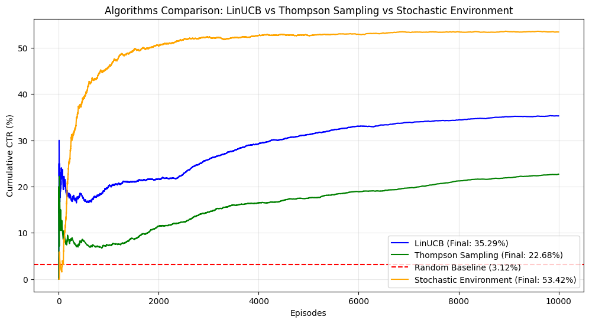
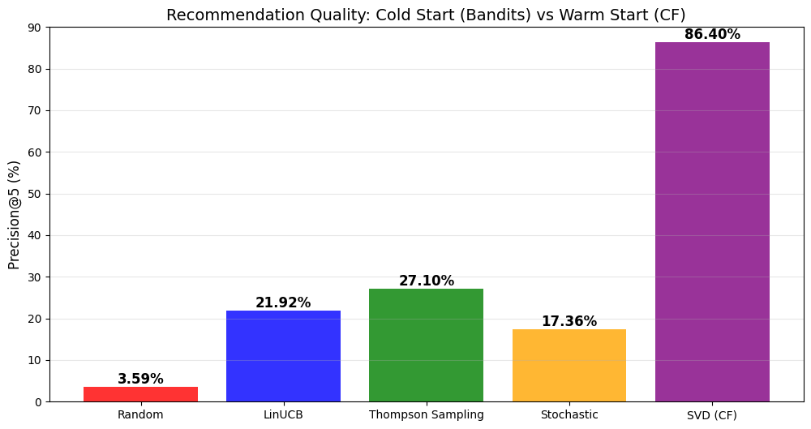

# Contextual Multi-Armed Bandits for Cold-Start Movie Recommendation


## 📌 Project Overview
This project tackles the **"Cold Start" problem** in recommender systems—how to recommend movies to new users with zero history. Unlike traditional Collaborative Filtering (which fails without data), we implemented **Contextual Multi-Armed Bandits (CMAB)** that learn user preferences in real-time by balancing exploration and exploitation.

We benchmarked three distinct architectures on the **MovieLens 100k** dataset:
1.  **LinUCB (Linear Upper Confidence Bound):** Deterministic optimism.
2.  **Linear Thompson Sampling (LinTS):** Probabilistic Bayesian exploration.
3.  **Stochastic Reward Environment (Novel Contribution):** A custom environment that assigns probabilistic rewards to "average" ratings (3-stars) to maximize user engagement.

## 🚀 Key Findings
Our experiments revealed a critical trade-off between **Convergence Speed** and **Recommendation Quality**:

| Algorithm | Role | Performance Highlight |
| :--- | :--- | :--- |
| **LinUCB** | **Speed Specialist** | Fastest convergence (**35.29% CTR**). Best for high-velocity streams. |
| **Thompson Sampling** | **Quality Specialist** | Superior List Quality (**27.10% Precision@5**). Best for "Top-N" lists. |
| **Stochastic Env(SE-LinUCB)** | **Engagement Engine** | Maximized total engagement volume (**53.42% CTR**) by capturing passive user interest. |

> **Note:** We also benchmarked against an offline **SVD (Collaborative Filtering)** model, which achieved 86.40% Precision@5, quantifying the "Cost of Cold Start" at approx. 59%.

## 🛠️ Algorithms Implemented
* **Contextual Bandits:** Disjoint LinUCB, Linear Thompson Sampling.
* **Environment:** Custom Gym-like environment for MovieLens data.
* **Reward Engineering:** Binary (Strict 4+ stars) vs. Stochastic (Probabilistic 3+ stars).
* **Baselines:** Random Agent, SVD (Matrix Factorization).

## 📊 Visualizations:

<p align="center">
  
 </p>
 
 <p align="center">
 
  </p>

 <p align="center">
  
</p>

## ⚙️ Installation & Usage

### A. Prerequisites
Ensure you have Python installed along with the following libraries:  

```bash
pip install numpy pandas matplotlib scipy

```

### B. Dataset
Download Link [GroupLens](https://grouplens.org "MovieLens Dataset Source")  


### C. Running the Simulation
Execute the main script (or notebook) to run the 10,000-episode simulation:

```bash

python main.py
# Or run the Jupyter Notebook
jupyter notebook Bandit_Movie_Recommender.ipynb

```

### D. Experiment Flow (What happens when you run main.py):

1. **Data Loading:** Checks for ml-100k data; downloads and preprocesses it (User Context Vectors) if missing.

2. **Simulations:** Runs 10,000-episode simulations for:

    * Random Agent (Baseline)

    * LinUCB Agent

    * Linear Thompson Sampling Agent

    * Stochastic Reward Agent SE-LinUCB (Proposed Method)

3. **Evaluation:** Calculates Cumulative CTR, Regret, and Precision@5 metrics for all agents.  

4. **Benchmarking:** Trains an offline SVD model to establish the theoretical performance ceiling.  

5. **Visualization:** Generates and displays comparative learning curves and bar charts.


## 📊 Key Results:

* **Speed:** LinUCB achieved the fastest convergence for Click-Through Rate (CTR).  

* **Quality:** Linear Thompson Sampling demonstrated superior recommendation quality (Precision@5) compared to LinUCB.  

* **Engagement:** The proposed Stochastic Environment significantly increased total engagement volume (~53% CTR) by capturing passive user interest.


---

🔮 Future Scope:

  * Hybrid Filtering: Transitioning from Bandits to Collaborative Filtering once sufficient user history is collected.

  * Neural Bandits: Implementing Deep Learning-based policies (NeuralUCB) to capture non-linear user-item relationships.

---

👥 Contributors:

  * **Rijaul Haque**

  * **Bhargab Kalita**

  * **Kangkita Baruah**

  *Dept. of Computer Science & Engineering,  
  Dibrugarh University Institute of Engineering & Technology(DUIET)*

---


📄 License:  

This project is licensed under the MIT License - see the LICENSE file for details.


---
